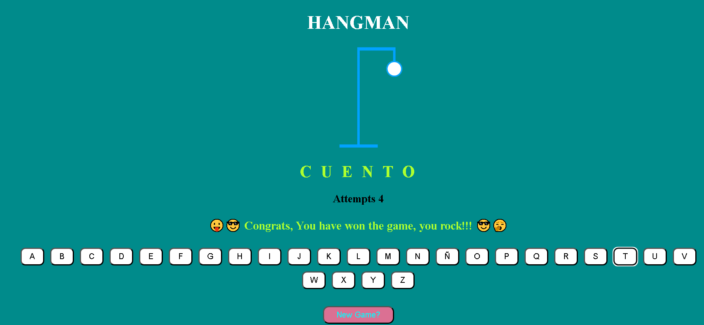

   


# Hangman Game



Welcome to the Hangman game! This is a simple web-based Hangman game built with `React` with `vite` using `TypeScript` to create functionalities within the application. Players guess letters to reveal a hidden word and attempt to solve it before running out of attempts.

## Table of Contents

- [Demo](#demo)
- [Features](#features)
- [Getting Started](#getting-started)
- [How to Play](#how-to-play)
- [Customization](#customization)
- [Contributing](#contributing)
- [License](#license)
- [Contact](#contact)

## Demo

You can play the Hangman game live by visiting the [demo link](#insert-demo-link-here).

## Features

- Randomly selects words from a predefined list.
- Tracks the player's attempts and displays hangman images.
- Notifies the player when they win or lose the game.
- Ability to start a new game.

## Getting Started

Follow these steps to get the Hangman game running locally on your machine:

1. Clone the repository:

   ```bash
   git clone https://github.com/romerolae/hangman-game.git
   ```

2. Navigate to the project directory:

   ```bash
   cd hangman-game
   ```

3. Install the required dependencies:

   ```bash
   npm install
   ```

4. Start the development server:

   ```bash
   npm run dev
   ```

5. Click on the link provided on the terminal or open your web browser and go to `http://localhost:3000` to play the game.

## How to Play

1. When you start the game, a random word will be selected from a predefined list, and the corresponding number of dashes representing the letters will be displayed as the hidden word.

2. You have a limited number of attempts (typically 9) to guess letters one by one.

3. Click on the letter buttons to guess. If the letter is in the word, it will be revealed in its correct position. If not, you'll lose an attempt, and a part of the hangman figure will be drawn.

4. Keep guessing letters until you either guess the word correctly or run out of attempts.

5. You win the game if you correctly guess all the letters in the word before running out of attempts. If you run out of attempts before guessing the word, you lose the game.

6. After winning or losing, you have the option to start a new game.

## Customization

You can customize this Hangman game by:

- Modifying the list of words in the `words` array in the `getRandomWord` function to include your own words.
- Styling the game interface in the `App.css` file and the components.
- Adding more hangman images for different difficulty levels.

Feel free to make the game your own by adding additional features or improvements.

## Contributing

Contributions are welcome! If you'd like to contribute to this project, please follow these steps:

1. Fork the repository.
2. Create a new branch for your feature or bug fix: `git checkout -b feature/your-feature-name`.
3. Commit your changes and push them to your forked repository.
4. Submit a pull request to the original repository.

Please follow the project's code of conduct and guidelines when contributing.

## License

This project is licensed under the MIT License - see the [LICENSE](LICENSE) file for details.

## Contact
For any inquiries or feedback, feel free to reach out to romerolae@gmail.com or connect with me on [LinkedIn](https://www.linkedin.com/in/romerolae/).


### Enjoy playing Hangman! 🤙